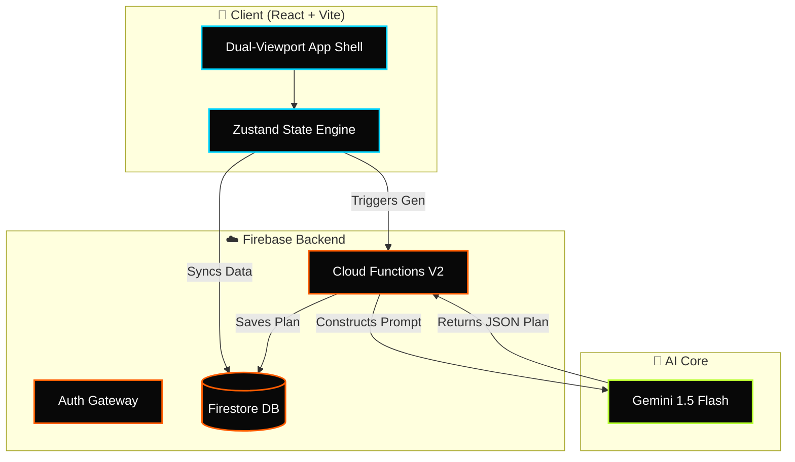

<div align="center">

  <!-- 🔥 Animated Typing Headline 🔥 -->
  <a href="https://github.com/PriyanshuG27/Fitdesi">
    
  </a>

  <!-- 🖼️ Dynamic Custom SVG Banner (Using CDN for guaranteed rendering) -->
  

  <br /><br />
  
  
  
  <h3>⚡ Premium Dark Athletic Gym Tracker &amp; Recovery Platform ⚡</h3>
  
  <p>
    <b>FitDesi</b> is a high-energy, OLED-optimized fitness platform tailored for the Indian gym culture. Build streaks, shatter PRs, and let Gemini AI craft your ultimate comeback.
  </p>

  <!-- 🛡️ Cool Tech Badges -->
  <p>
    
    
    
    
    
    
  </p>
</div>

---

## 🚀 The Control Center (System Status)

> **"Your body is a machine. This is the dashboard."**

<table align="center" style="border-collapse: collapse; border: 2px solid #333; background: #080808; font-family: 'Courier New', Courier, monospace; width: 100%; border-radius: 8px; overflow: hidden;">
  <tr style="border-bottom: 1px solid #333;">
    <td style="padding: 15px; border-right: 1px solid #333;"><strong>⚡ STATUS</strong></td>
    <td style="padding: 15px; color: #B5FF2D; border-right: 1px solid #333; text-shadow: 0 0 5px #B5FF2D;">🟢 PRODUCTION ACTIVE</td>
    <td style="padding: 15px; border-right: 1px solid #333;"><strong>🤖 AI ENGINE</strong></td>
    <td style="padding: 15px; color: #00D4FF; text-shadow: 0 0 5px #00D4FF;">⚡ GEMINI 1.5 FLASH</td>
  </tr>
  <tr>
    <td style="padding: 15px; border-right: 1px solid #333;"><strong>💾 CORE DB</strong></td>
    <td style="padding: 15px; color: #FF5C00; border-right: 1px solid #333; text-shadow: 0 0 5px #FF5C00;">🔥 FIRESTORE</td>
    <td style="padding: 15px; border-right: 1px solid #333;"><strong>🔒 SECURITY</strong></td>
    <td style="padding: 15px; color: #F0F0F0; text-shadow: 0 0 5px #FFF;">🛡️ FIREBASE AUTH</td>
  </tr>
</table>

---

## 🔥 Features that make FitDesi Insane

| Feature | Description | Why it matters |
| :--- | :--- | :--- |
| 🎨 **Neubrutalism UI** | Deep OLED Black base with Burnt Orange, Electric Cyan, and Acid Lime accents. | Saves battery + Ultra-high contrast in bright gyms. |
| 🧠 **Gemini-Powered AI** | Serverless AI that auto-generates plans based on your equipment and medical flags. | No more guessing. Total optimization. |
| 🩹 **Phoenix Protocol** | 8-week structured protocol to rebuild strength after a long break without injury. | Keeps ego in check, prevents day-1 injuries. |
| 🛡️ **Medical Safety Rules** | Automatically bans unsafe exercises (e.g., Heavy Squats for bad knees). | Train hard, but train safe. |
| 🎮 **Gamification & XP** | Level up from **Rookie** 🟢 to **Elite** 🔴 by hitting PRs and keeping streaks. | Pure addiction to the grind. |
| ⌨️ **Power-User Hotkeys** | Instant logging with `<kbd>Alt</kbd> + <kbd>S</kbd>` and quick add shortcuts. | Never slow down your workout flow. |

---

## 📐 AI Architecture & Flow



---

## 🎮 Gamification & Tiers

Your sweat translates into points. Hit PRs, complete missions, and rise through the ranks.

- **Rookie 🟢** (Lv 1-5): The beginning of the journey.
- **Challenger 🔵** (Lv 6-15): Unlock custom challenges & streak warnings.
- **Athlete 🟡** (Lv 16-30): Access deep 180-day progress charts.
- **Elite 🔴** (Lv 31+): Unlock global leaderboards and Streak Shields.

> 💎 **Pro Tip:** Completing a **Phoenix Comeback Session** awards a **2x XP Multiplier!**

---

## 🛠️ Quick Start (Developer Mode)

Ready to enter the code? 

```bash
# 1. Clone the matrix
git clone https://github.com/PriyanshuG27/Fitdesi.git
cd Fitdesi

# 2. Install dependencies (Client & Backend)
npm install
cd functions && npm install && cd ..

# 3. Ignite the Emulators & Client
firebase emulators:start
npm run dev
```

> **Warning:** You must configure your `.env` and `.env.local` files with your Firebase and Gemini credentials before running. See the `docs/` folder for the exact blueprint.

---

## 📖 Deep-Dive Reference Docs

* 📄 [Product Requirements Document (PRD)](./docs/PRD.md)
* 📄 [Technical Requirements Document (TRD)](./docs/TRD.md)
* 📄 [UI/UX Design Specification Brief](./docs/UI_UX_BRIEF.md)
* 📄 [Environment Configuration Guide](./docs/ENV_CONFIG.md)

---
<div align="center">
  <i>"Discipline equals freedom."</i> <br/>
  <b>Built for the Comeback. Built for FitDesi.</b>
</div>
